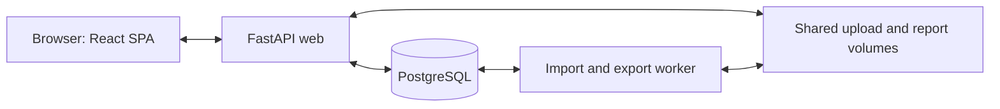

# VulnBatch

VulnBatch turns recurring Tenable VM and Nessus scan exports into a persistent, host-centered vulnerability
inventory. It focuses on Medium and Low findings, conservative asset matching, identity review, backlog
aging, and maintenance-window reports.

## The easy Windows setup

You need:

1. A Windows 10 or 11 computer.
2. [Docker Desktop](https://www.docker.com/products/docker-desktop/) installed and running.
3. This entire VulnBatch folder. Do not move only the `.bat` files.

Then:

1. Double-click **`Start VulnBatch.bat`**.
2. Keep the window open during the first build. The first start can take several minutes.
3. Your browser opens to [http://localhost:8787](http://localhost:8787).
4. Create your administrator account. There is no default username or password.

The launcher automatically:

- starts Docker Desktop when it can;
- creates `.env` with unique random secrets on the first run;
- checks the configuration;
- builds and starts the database, web application, and background worker;
- applies database migrations; and
- waits until VulnBatch is actually ready.

If Windows asks whether PowerShell may run, allow this local launcher. It does not install system software,
send telemetry, or connect VulnBatch to an external service.

## Daily use

- Start: double-click **`Start VulnBatch.bat`**.
- Open: visit [http://localhost:8787](http://localhost:8787).
- Check: double-click **`VulnBatch Status.bat`**.
- Stop: double-click **`Stop VulnBatch.bat`**.

Stopping VulnBatch preserves its database, uploads, and reports. Starting it again brings the same data back.

Never run `docker compose down -v` with important data. The `-v` option permanently deletes the VulnBatch
database, original uploads, and generated reports.

## First useful workflow

1. Sign in as the administrator.
2. Open **Imports**.
3. Choose Tenable CSV, Tenable JSON/NDJSON, Nessus XML, or Generic CSV.
4. Upload the file. Generic CSV first shows a mapping preview.
5. Review the import summary and any identity-review warnings.
6. Open **Identity review** and resolve ambiguous hosts. VulnBatch does not silently merge ambiguous assets.
7. Open **Hosts** to filter the full server-side inventory.
8. Choose rows on the current page, or deliberately choose **Export all matching**.
9. Review the host and finding counts, submit the report, and download it from **Exports**.

Reports are available as XLSX, a ZIP of CSV files, and printable HTML. XLSX includes **Host Summary**,
**Finding Detail**, and **Export Metadata** sheets.

## Accounts

The first person creates the first administrator account in the browser. Administrators can add named
administrator or read-only accounts under **Users**.

Use a password with at least 14 characters. Do not share one administrator account among several people.
Read-only users can view data and create/download their own reports, but cannot import data, resolve identity,
change settings, or manage users.

## Backups

Double-click **`Back Up VulnBatch.bat`** to create a timestamped PostgreSQL database dump and checksum in the
`backups` folder.

Important: a complete recovery set also needs the original-upload and generated-report Docker volumes. The
button says this clearly after it finishes. Follow [Backup and Restore](docs/backup-restore.md) before an
upgrade or whenever the data matters. Restore is intentionally a command-line operation because it replaces
the current database and must not happen accidentally.

## Updating or rebuilding

After replacing application files with a newer VulnBatch version:

1. Take a complete backup.
2. Double-click **`Stop VulnBatch.bat`**.
3. Double-click **`Start VulnBatch.bat`**.

The launcher rebuilds the local image and applies forward database migrations. Do not replace `.env` unless
you intentionally want new application secrets and understand the session/database consequences.

## If it does not start

Try these in order:

1. Open Docker Desktop and wait until it says the engine is running.
2. Double-click **`Start VulnBatch.bat`** again.
3. Double-click **`VulnBatch Status.bat`**.
4. Confirm another application is not using port 8787.
5. Read [Plain-language Troubleshooting](docs/troubleshooting.md).

The launcher does not delete data when it fails. Recent service logs are shown when startup cannot complete.

## Local service map

FastAPI serves the React client and its API. PostgreSQL holds application and job
state; the worker handles imports and exports. The web service and worker share the
upload and report volumes.



See [architecture](docs/architecture.md), [Compose services](compose.yaml),
[API startup](backend/vulnbatch/main.py), and [worker](backend/vulnbatch/worker.py).

## Technical startup

People who prefer a terminal can run:

```powershell
.\scripts\Start-VulnBatch.ps1
```

The underlying clean-build command is:

```powershell
docker compose config --quiet
docker compose up -d --build
```

The default application address is `http://localhost:8787`. Interactive OpenAPI documentation is available
locally at `http://localhost:8787/docs`; do not expose the default localhost deployment to an untrusted
network.

## Validation commands used for this implementation

Backend:

```powershell
.\.venv\Scripts\python.exe -m ruff check backend tests scripts\validation
.\.venv\Scripts\python.exe -m mypy backend
$env:PYTHONPATH='backend'
.\.venv\Scripts\python.exe -m pytest -q
python scripts\validation\smoke_e2e.py
```

Frontend:

```powershell
npm --prefix frontend run lint
npm --prefix frontend run typecheck
npm --prefix frontend test
npm --prefix frontend run build
```

Docker and recovery:

```powershell
docker compose config --quiet
.\scripts\Start-VulnBatch.ps1 -NoBrowser
.\scripts\backup-db.ps1 -FileName final-validation.dump
.\scripts\restore-db.ps1 -FileName final-validation.dump -ConfirmReplaceDatabase
python scripts\validation\verify_persisted_state.py
```

Synthetic scale validation:

```powershell
python scripts\validation\load_100k.py
```

The last 100,000-row run stayed within configured memory limits but exceeded its 30-minute completion limit.
That result is recorded in `tmp/load-100k/summary.json` and is a known core scalability blocker, not a pass.

## Design and operations documentation

- [Requirements traceability](docs/requirements-traceability.md)
- [Architecture](docs/architecture.md)
- [Asset identity](docs/asset-identity.md)
- [Finding lifecycle, maturity, and SLA](docs/finding-lifecycle.md)
- [Host query and exports](docs/host-query-exports.md)
- [Import formats](docs/import-formats.md)
- [Security](docs/security.md)
- [Backup and restore](docs/backup-restore.md)
- [Troubleshooting](docs/troubleshooting.md)
